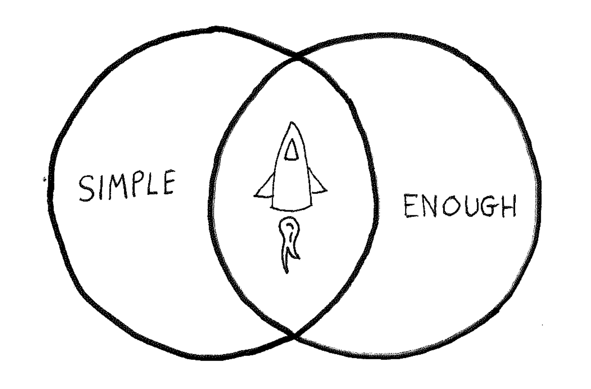

[Adam](https://www.linkedin.com/in/adam-curl-23a2911b3/) and I were meeting about a sketch we made for the software we were building. We posed the [Essential Release](/glossary#essential-release) question, "In this sketch, what is not required for this view to work?"

We removed many features saying, "No, the data filtering or search option isn't needed. Nor is the bulk-action feature."

After that, with every area of the application, our goal was to launch in 2 weeks with just the required features. The software would work, but with very few bells and wistles.

This idea, *launch with simply-enough*, seems obvious in the world of Agile. Yet, this approach reminded us of the value of early releases.

When you release early you can decide what truely is high-priority.

<!-- TODO: come back to point to the 3 take aways on SH blog -->